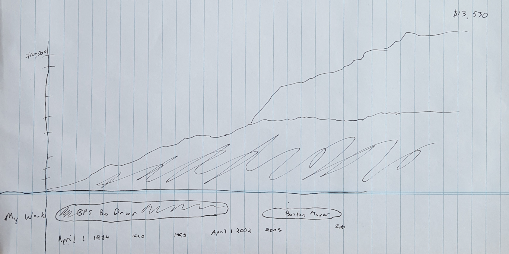
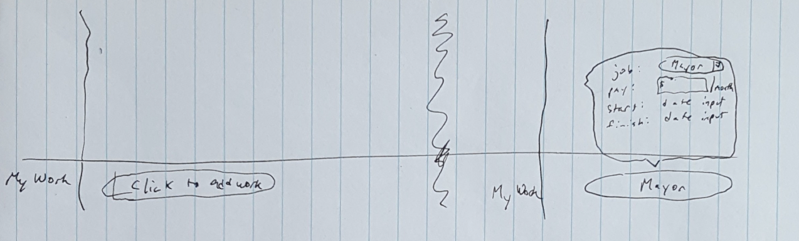
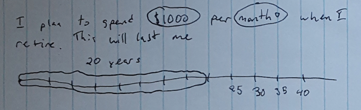
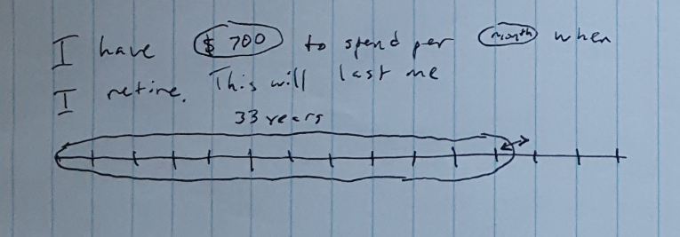
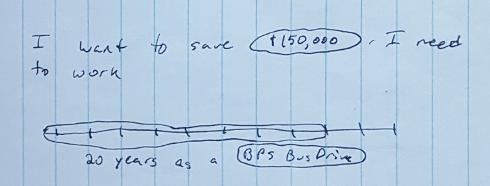
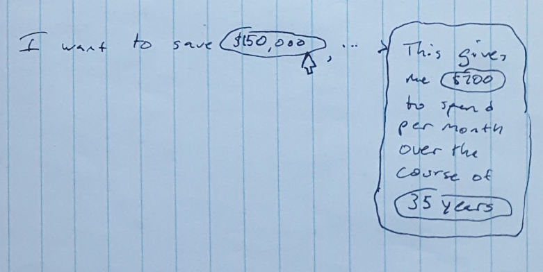
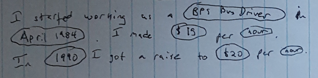

# User Interface Prototypes

The main interface for exploring accumulated pension. This features an
adjustable timeline on the bottom color-coded to match with the accumulated
pension funds. The jobs are draggable and interactable similar to what is shown
in "Adding a Job". 

When there is no work in the timeline, users are prompted to add work. This
starts editing the timeline bar immediately with a contextualized pop-up.

These two show some exploratory interfaces for measuring retirement funds on a
different scale. The amount per month and the scale are all draggable as shown
in "Interacting with How Long".

Another possible use of this tool is as a planning device. Here the editable
paragraph is tied to prospective work with the same timeline visualization.

In planning, the interface can provide an explorable explanation of the
calculated pension from several perspectives. The one shown here goes back to
the how long at a certain rate the money will last.

This presents a textual description of the user's work history allowing them to
correct errors in the program's description of their narrative.
